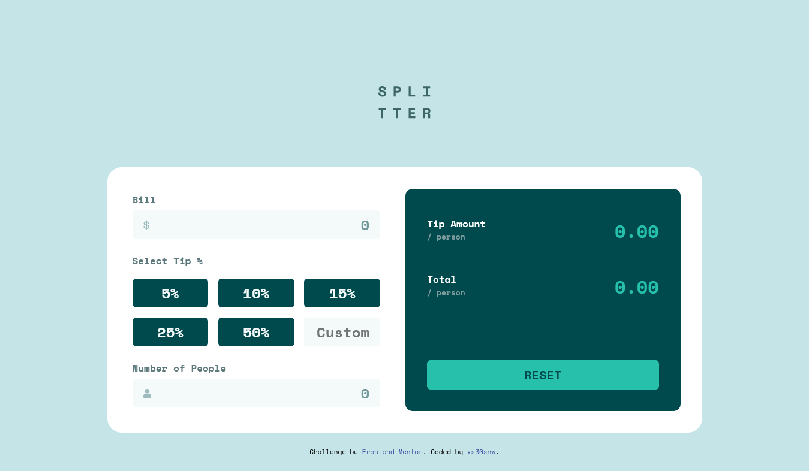

# Frontend Mentor - Tip calculator app solution

This is a solution to the [Tip calculator app challenge on Frontend Mentor](https://www.frontendmentor.io/challenges/tip-calculator-app-ugJNGbJUX).

- Live Site URL: [GitHub Pages](https://xs30snw.github.io/FEM_tip-calculator-app/)

## Screenshot

## Existing issues

- [ ] JS doesn't handle incorrect data at inputs (strings, special characters, etc);
- [ ] There is no limit to characters at inputs. Large numbers cause layout to break.
